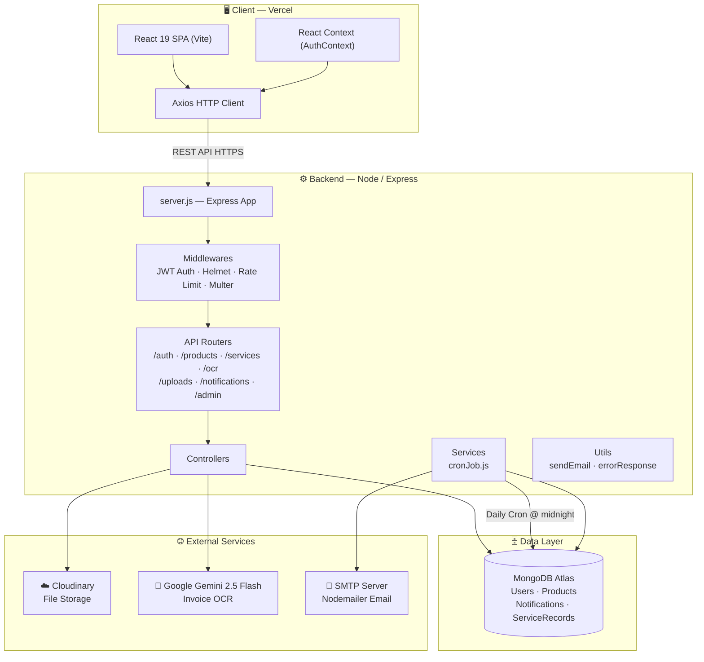
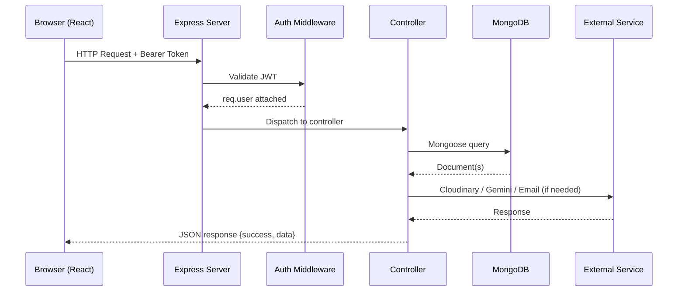
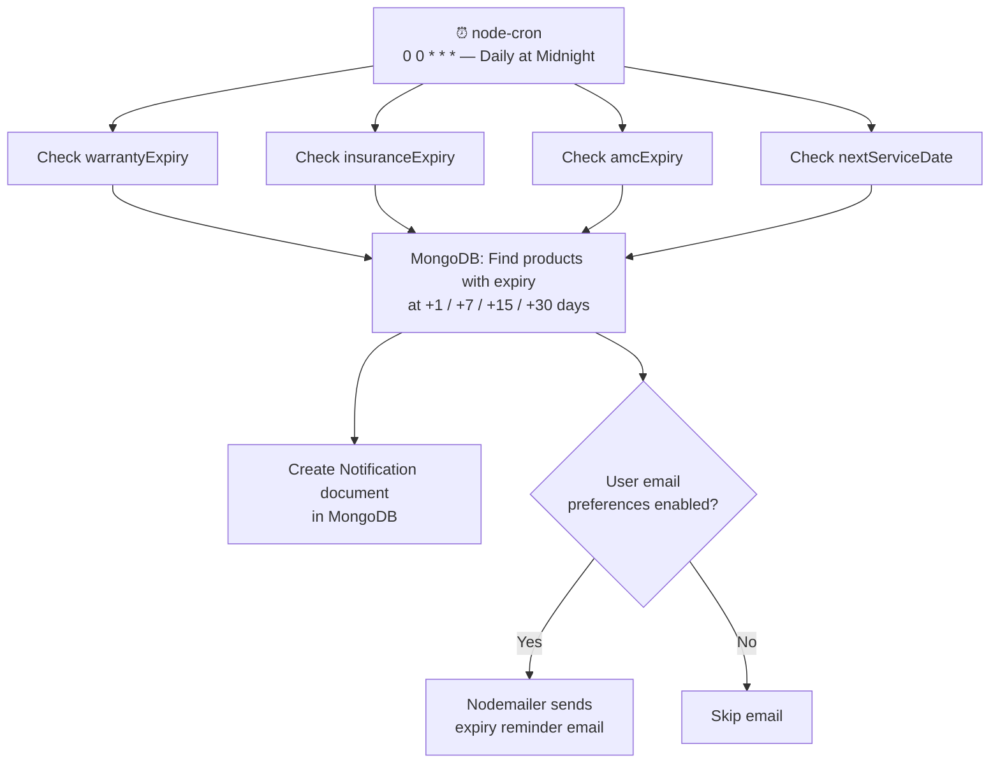
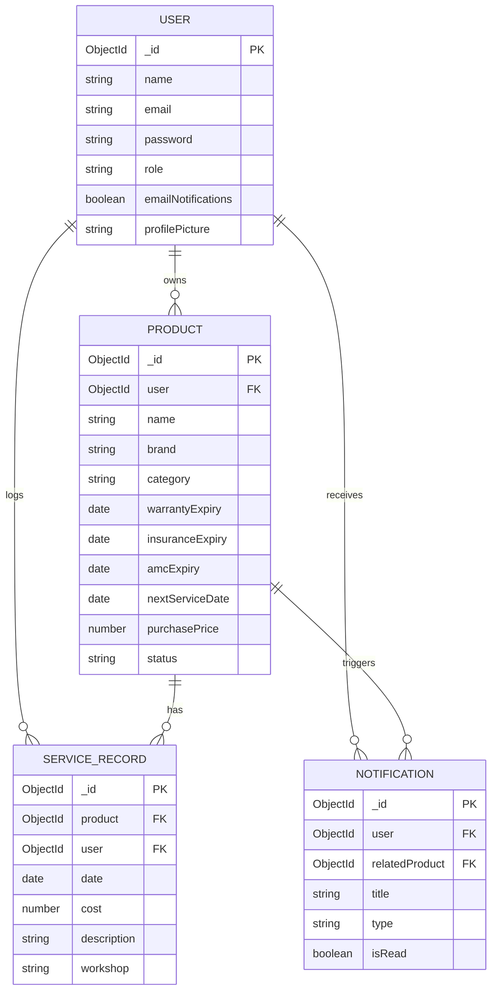
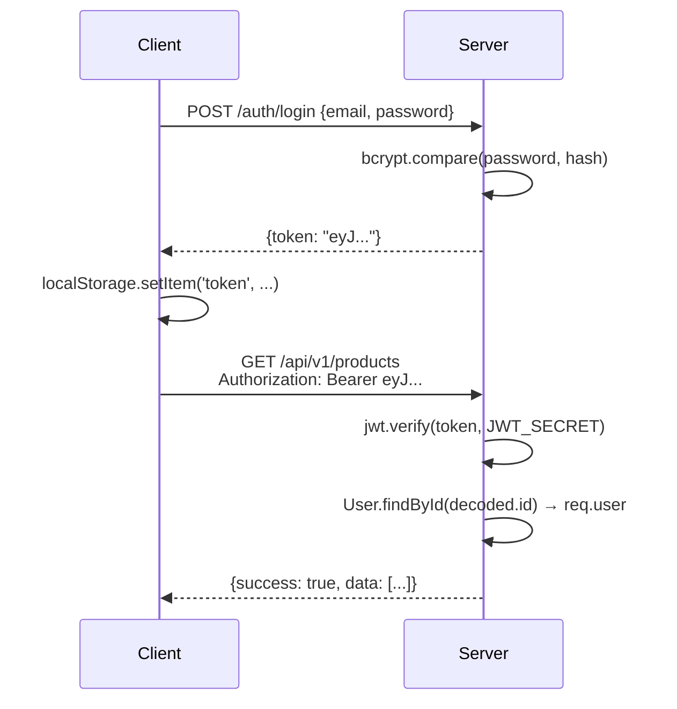

<h1 align="center">🛡️ Smart Warranty Manager</h1>

<p align="center">
  <strong>An intelligent, full-stack appliance lifecycle management platform powered by AI-driven OCR, automated notifications, and cloud document archival.</strong>
</p>

<p align="center">
  <a href="https://smart-warranty-manager.vercel.app/" target="_blank">
    
  </a>
  
  
  
  
</p>

---

## 📋 Table of Contents

1. [Overview](#-overview)
2. [The Problem](#-the-problem)
3. [The Solution](#-the-solution)
4. [Live Demo](#-live-demo)
5. [Core Features](#-core-features)
6. [Tech Stack](#-tech-stack)
7. [System Architecture](#-system-architecture)
8. [Repository Structure](#-repository-structure)
9. [Data Models](#-data-models)
10. [API Reference](#-api-reference)
11. [Authentication & Security](#-authentication--security)
12. [Notification Engine](#-notification-engine)
13. [AI / OCR Pipeline](#-ai--ocr-pipeline)
14. [Frontend Architecture](#-frontend-architecture)
15. [Environment Variables](#-environment-variables)
16. [Local Development Setup](#-local-development-setup)
17. [Deployment](#-deployment)
18. [Contributing](#-contributing)
19. [License](#-license)

---

## 🔍 Overview

**Smart Warranty Manager** is an enterprise-grade, full-stack web application that solves the universal consumer pain point of mismanaged product warranties, forgotten service schedules, and disorganized appliance documentation.

Built on the **MERN** stack (MongoDB, Express.js, React.js, Node.js), it brings together **Google Gemini AI vision**, **Cloudinary cloud storage**, **JWT-secured REST APIs**, and a **cron-driven notification engine** into a single cohesive platform that digitizes and automates the entire appliance lifecycle.

---

## 🚨 The Problem

Every household and business owns dozens of appliances and products, each carrying:

- A **warranty** that silently expires
- An **insurance policy** renewal deadline
- An **Annual Maintenance Contract (AMC)** cutoff
- A **recommended service interval**
- A physical **invoice** and **user manual** that gets lost

When something breaks, users scramble to find out if it is still under warranty, dig through physical folders, or realize too late that coverage has lapsed. Missing routine maintenance can also **void existing warranties**, turning a preventable repair into a major unplanned expense.

---

## ✅ The Solution

Smart Warranty Manager provides a **centralized digital command centre** for all product assets:

| Problem | Solution |
|---|---|
| Lost invoices & manuals | Permanent cloud storage on Cloudinary |
| Manual data entry from receipts | AI-powered OCR via Google Gemini 2.5 Flash |
| Forgotten warranty expiry | Automated daily email + in-app alerts |
| No maintenance history | Service record ledger with cost tracking |
| No financial overview | Real-time analytics dashboard |
| Scattered product data | Searchable, filterable centralized product registry |

---

## 🌐 Live Demo

> **Production URL:** [https://smart-warranty-manager.vercel.app/](https://smart-warranty-manager.vercel.app/)

The frontend is deployed on **Vercel**. The backend API is hosted separately and connected via environment-configured base URLs.

---

## ✨ Core Features

### 🤖 AI-Powered Invoice Scanning (OCR)
Upload a photo of any purchase invoice and the system sends it to **Google Gemini 2.5 Flash**. The AI returns structured JSON — product name, brand, model number, purchase date, seller, and amount — and auto-fills the product registration form. Zero manual typing.

### 🔔 Proactive Notification Engine
A **Node-Cron** job runs every day at midnight and checks all products for upcoming expiry dates across four dimensions:
- **Warranty Expiry**
- **Insurance Expiry**
- **AMC Expiry**
- **Next Service Date**

Alerts are dispatched at **30 days, 15 days, 7 days, and 1 day** before each deadline, both as in-app notifications and via **Nodemailer** transactional email (respecting per-user email preferences).

### ☁️ Cloud Document Vault
Securely stores **PDFs and images** (invoices, manuals, product photos) on **Cloudinary**. Documents are linked to individual product records and retrievable at any time.

### 📊 Analytics Dashboard
Real-time summary of:
- Total active warranties
- Warranties/services expiring in the next 30 days
- Total product portfolio value
- Upcoming service deadlines

### 🗂️ Service & Financial History
A per-product **maintenance ledger** logs every service event with date, cost, workshop name, description, and an optional invoice attachment, enabling full lifetime cost-of-ownership tracking.

### 👥 Role-Based Access Control
- **User Role:** Full CRUD over personal products, service records, notifications, and profile settings.
- **Admin Role:** Access to an admin dashboard with global user and product analytics.

### 🔐 Complete Auth System
- JWT-based stateless authentication
- bcrypt password hashing (salt rounds: 10)
- Secure password reset via time-limited email tokens (10-minute expiry)
- Per-user email notification preferences

---

## 🧰 Tech Stack

### Frontend

| Technology | Version | Purpose |
|---|---|---|
| React.js | 19.x | UI framework |
| Vite | 8.x | Build tool & dev server |
| React Router DOM | 7.x | Client-side routing |
| Tailwind CSS | 4.x | Utility-first styling |
| Framer Motion | 12.x | Animations & transitions |
| Axios | 1.x | HTTP client |
| React Hook Form | 7.x | Form state management |
| React Hot Toast | 2.x | Toast notifications |
| Lucide React | 1.x | Icon library |
| date-fns | 4.x | Date formatting |
| clsx + tailwind-merge | — | Conditional class composition |
| oxlint | 1.x | Ultra-fast linting |

### Backend

| Technology | Version | Purpose |
|---|---|---|
| Node.js | — | JavaScript runtime |
| Express.js | 5.x | HTTP server & routing |
| MongoDB | — | NoSQL database |
| Mongoose | 9.x | ODM / schema modeling |
| JSON Web Token (JWT) | 9.x | Authentication tokens |
| bcrypt | 6.x | Password hashing |
| Nodemailer | 9.x | Transactional email |
| Node-Cron | 4.x | Scheduled background tasks |
| Multer | 2.x | Multipart file upload handling |
| multer-storage-cloudinary | 4.x | Direct Cloudinary upload stream |
| Cloudinary | 1.x | Cloud asset management |
| @google/generative-ai | 0.24.x | Google Gemini AI SDK |
| Helmet | 8.x | HTTP security headers |
| express-rate-limit | 8.x | API rate limiting |
| express-validator | 7.x | Input validation |
| Morgan | 1.x | HTTP request logging |
| dotenv | 17.x | Environment variable management |
| nodemon | 3.x | Dev auto-restart |

---

## 🏛️ System Architecture

### High-Level Architecture



---

### Request Lifecycle



---

### OCR Invoice Pipeline

```mermaid
flowchart LR
    A["User uploads invoice image"] --> B["Multer middleware buffers file"]
    B --> C["multer-storage-cloudinary<br/>streams file to Cloudinary"]
    C --> D["Cloudinary returns secure URL"]
    D --> E["Frontend sends URL to POST /api/v1/ocr"]
    E --> F["ocrController fetches image as base64"]
    F --> G["Sends base64 + prompt to<br/>Gemini 2.5 Flash Vision API"]
    G --> H["Gemini returns raw JSON<br/>productName · brand · model<br/>purchaseDate · seller · amount"]
    H --> I["Controller strips markdown wrappers"]
    I --> J["Returns parsed JSON to client"]
    J --> K["ProductForm auto-fills fields"]
```



---

### Notification Engine Flow



---

## 📁 Repository Structure

```
Smart-Warranty-Manager/
│
├── frontend/                         # React SPA (Vite)
│   ├── public/                       # Static assets
│   ├── src/
│   │   ├── assets/                   # Images, icons, static media
│   │   ├── components/
│   │   │   ├── Layout.jsx            # App shell (sidebar + outlet)
│   │   │   ├── ProtectedRoute.jsx    # Auth guard HOC
│   │   │   └── Sidebar.jsx           # Navigation sidebar
│   │   ├── context/
│   │   │   └── AuthContext.jsx       # Global auth state (login, logout, user)
│   │   ├── pages/
│   │   │   ├── Login.jsx             # Authentication screen
│   │   │   ├── ForgotPassword.jsx    # Password reset request
│   │   │   ├── ResetPassword.jsx     # Token-based password reset
│   │   │   ├── Dashboard.jsx         # Analytics overview
│   │   │   ├── Products.jsx          # Product listing + search + filter
│   │   │   ├── ProductForm.jsx       # Add / Edit product (with OCR)
│   │   │   ├── Notifications.jsx     # In-app notification center
│   │   │   ├── Profile.jsx           # User settings & preferences
│   │   │   └── AdminDashboard.jsx    # Admin-only analytics panel
│   │   ├── services/
│   │   │   └── api.js                # Axios instance with base URL + interceptors
│   │   ├── App.jsx                   # Route declarations (React Router v7)
│   │   ├── main.jsx                  # React DOM root mount
│   │   └── index.css                 # Global Tailwind directives
│   ├── index.html
│   ├── vite.config.js
│   ├── tailwind.config.js
│   ├── postcss.config.js
│   ├── vercel.json                   # Vercel SPA rewrite rules
│   └── package.json
│
├── backend/                          # Node.js / Express API
│   ├── server.js                     # Entry point — mounts all routers
│   ├── src/
│   │   ├── config/
│   │   │   └── db.js                 # Mongoose connection (with retry logic)
│   │   ├── controllers/
│   │   │   ├── authController.js     # register, login, forgotPassword, resetPassword
│   │   │   ├── productController.js  # CRUD for products + dashboard stats
│   │   │   ├── serviceRecordController.js  # Service history CRUD
│   │   │   ├── notificationController.js   # Get, mark read, delete notifications
│   │   │   ├── uploadController.js   # File upload to Cloudinary
│   │   │   ├── ocrController.js      # Gemini Vision OCR pipeline
│   │   │   └── adminController.js    # Admin stats (users, products)
│   │   ├── middlewares/
│   │   │   ├── auth.js               # JWT protect() + authorize() (RBAC)
│   │   │   ├── error.js              # Global error handler middleware
│   │   │   └── upload.js             # Multer + Cloudinary storage config
│   │   ├── models/
│   │   │   ├── User.js               # User schema (bcrypt hooks, password reset)
│   │   │   ├── Product.js            # Product schema (indexes, documents)
│   │   │   ├── ServiceRecord.js      # Service log schema
│   │   │   └── Notification.js       # Notification schema
│   │   ├── routes/
│   │   │   ├── authRoutes.js
│   │   │   ├── productRoutes.js
│   │   │   ├── serviceRecordRoutes.js
│   │   │   ├── uploadRoutes.js
│   │   │   ├── ocrRoutes.js
│   │   │   ├── notificationRoutes.js
│   │   │   └── adminRoutes.js
│   │   ├── services/
│   │   │   └── cronJob.js            # Daily expiry checker (node-cron)
│   │   └── utils/
│   │       ├── sendEmail.js          # Nodemailer email dispatcher
│   │       └── errorResponse.js      # Custom Error class
│   └── package.json
│
├── server/                           # Standalone cron/SRV resolver utility
│   ├── config/
│   │   └── db.js
│   ├── resolve_srv.js                # DNS SRV resolution helper for MongoDB Atlas
│   ├── triggerCron.js                # Manual cron trigger script
│   ├── server.js
│   └── package.json
│
├── push_repo.bat                     # Git convenience script
├── .gitignore
└── README.md
```

---

## 🗃️ Data Models

### User

```
User {
  _id         : ObjectId
  name        : String   (required)
  email       : String   (required, unique, validated)
  password    : String   (hashed via bcrypt, select: false)
  role        : String   (enum: 'user' | 'admin', default: 'user')
  preferences : {
    emailNotifications: Boolean (default: true)
  }
  profilePicture       : String
  resetPasswordToken   : String
  resetPasswordExpire  : Date
  createdAt / updatedAt
}
```

> **Pre-save hook:** Automatically bcrypt-hashes the password with 10 salt rounds before every save where `password` is modified.
>
> **Instance methods:**
> - `matchPassword(enteredPassword)` — compares plain-text against hash
> - `getResetPasswordToken()` — generates a crypto-random token, hashes it, stores hash, returns raw token for email

---

### Product

```
Product {
  _id             : ObjectId
  user            : ObjectId → ref: User   (required)
  name            : String   (required)
  brand           : String   (required)
  category        : String   (required)
  modelNumber     : String
  serialNumber    : String
  purchaseDate    : Date
  purchasePrice   : Number
  warrantyExpiry  : Date
  insuranceExpiry : Date
  amcExpiry       : Date
  lastServiceDate : Date
  nextServiceDate : Date
  sellerName      : String
  sellerContact   : String
  serviceCenter   : String
  notes           : String
  status          : String   (enum: 'active' | 'archived', default: 'active')
  documents : {
    invoice : { url: String, publicId: String }
    manual  : { url: String, publicId: String }
    images  : [{ url: String, publicId: String }]
  }
  createdAt / updatedAt
}
```

> **Indexes:** Compound text index on `name`, `brand`, `category`, `serialNumber`, `sellerName` for full-text search. Separate compound indexes on `warrantyExpiry`, `insuranceExpiry`, `amcExpiry`, and `status` per user, optimizing cron queries and dashboard filters.

---

### ServiceRecord

```
ServiceRecord {
  _id              : ObjectId
  product          : ObjectId → ref: Product   (required)
  user             : ObjectId → ref: User      (required)
  date             : Date      (required)
  cost             : Number    (default: 0)
  description      : String    (required)
  workshop         : String
  remarks          : String
  invoiceUrl       : String
  invoicePublicId  : String
  createdAt / updatedAt
}
```

---

### Notification

```
Notification {
  _id            : ObjectId
  user           : ObjectId → ref: User      (required)
  title          : String    (required)
  message        : String    (required)
  type           : String    (enum: 'warranty' | 'service' | 'insurance' | 'amc' | 'system')
  isRead         : Boolean   (default: false)
  relatedProduct : ObjectId → ref: Product
  createdAt / updatedAt
}
```

---

### Entity Relationship Diagram



---

## 📡 API Reference

All routes are prefixed with `/api/v1`. Protected routes require `Authorization: Bearer <token>`.

### Auth — `/api/v1/auth`

| Method | Endpoint | Auth | Description |
|---|---|---|---|
| `POST` | `/register` | ❌ | Create new user account |
| `POST` | `/login` | ❌ | Login and receive JWT |
| `GET` | `/me` | ✅ | Get current authenticated user |
| `PUT` | `/me` | ✅ | Update profile (name, picture, preferences) |
| `PUT` | `/me/password` | ✅ | Change password |
| `POST` | `/forgotpassword` | ❌ | Send password reset email |
| `PUT` | `/resetpassword/:resettoken` | ❌ | Reset password via token |

### Products — `/api/v1/products`

| Method | Endpoint | Auth | Description |
|---|---|---|---|
| `GET` | `/` | ✅ | Get all products (supports `?search=`, `?category=`, `?status=`) |
| `POST` | `/` | ✅ | Create new product |
| `GET` | `/:id` | ✅ | Get single product |
| `PUT` | `/:id` | ✅ | Update product |
| `DELETE` | `/:id` | ✅ | Delete product + Cloudinary assets |
| `GET` | `/dashboard/stats` | ✅ | Dashboard analytics aggregation |

### Service Records — `/api/v1/services`

| Method | Endpoint | Auth | Description |
|---|---|---|---|
| `GET` | `/product/:productId` | ✅ | Get all service records for a product |
| `POST` | `/product/:productId` | ✅ | Add service record to a product |
| `DELETE` | `/:id` | ✅ | Delete a service record |

### OCR — `/api/v1/ocr`

| Method | Endpoint | Auth | Description |
|---|---|---|---|
| `POST` | `/extract` | ✅ | Send Cloudinary image URL → Gemini Vision → extracted product data |

### File Uploads — `/api/v1/uploads`

| Method | Endpoint | Auth | Description |
|---|---|---|---|
| `POST` | `/` | ✅ | Upload file (invoice/manual/image) → Cloudinary → return URL + publicId |

### Notifications — `/api/v1/notifications`

| Method | Endpoint | Auth | Description |
|---|---|---|---|
| `GET` | `/` | ✅ | Get all notifications for current user |
| `PUT` | `/:id/read` | ✅ | Mark notification as read |
| `DELETE` | `/:id` | ✅ | Delete a notification |

### Admin — `/api/v1/admin`

| Method | Endpoint | Auth | Role |
|---|---|---|---|
| `GET` | `/stats` | ✅ | `admin` |

---

## 🔐 Authentication & Security

The application implements multiple layers of security:

| Layer | Implementation |
|---|---|
| Password hashing | bcrypt with 10 salt rounds (Mongoose pre-save hook) |
| Session tokens | JWT signed with `JWT_SECRET`, stored in `localStorage` on client |
| Route protection | `protect` middleware verifies JWT and attaches `req.user` |
| Role-based access | `authorize('admin')` middleware for admin-only routes |
| HTTP headers | `helmet` sets security headers (XSS, HSTS, noSniff, etc.) |
| Rate limiting | `express-rate-limit` prevents brute-force attacks |
| Input validation | `express-validator` on all mutation endpoints |
| Password reset | Crypto-random tokens, SHA-256 hashed server-side, 10-minute expiry |
| CORS | Configured via `cors` middleware |

### JWT Flow



---

## 🔔 Notification Engine

The cron job (`backend/src/services/cronJob.js`) is started at server boot via `startCronJobs()` and runs on the schedule `0 0 * * *` (midnight daily).

**Check thresholds:** +1 day, +7 days, +15 days, +30 days

**Monitored fields per product:**
1. `warrantyExpiry` → type: `"Warranty"`
2. `insuranceExpiry` → type: `"Insurance"`
3. `amcExpiry` → type: `"AMC"`
4. `nextServiceDate` → type: `"Service"`

For each match the engine:
1. Creates a `Notification` document in MongoDB
2. Checks `user.preferences.emailNotifications`
3. If enabled, dispatches a formatted HTML email via Nodemailer (SMTP)

Email configuration supports any SMTP provider (Gmail App Passwords recommended for development; SendGrid/Mailgun for production).

---

## 🤖 AI / OCR Pipeline

**Model:** `gemini-2.5-flash` (Google Generative AI SDK)

**Trigger:** User clicks "Scan Invoice" in `ProductForm.jsx` after uploading an invoice image.

**Prompt Engineering:** A structured zero-shot prompt instructs Gemini to return a **pure JSON object** (no markdown wrappers) with the following fields:

```json
{
  "productName": "string or empty",
  "brand": "string or empty",
  "modelNumber": "string or empty",
  "purchaseDate": "YYYY-MM-DD or empty",
  "invoiceNumber": "string or empty",
  "seller": "string or empty",
  "purchaseAmount": "number or empty"
}
```

**Robustness:** The controller includes a post-processing step that strips markdown code fences (` ```json `) that some model responses include before JSON parsing.

---

## 🎨 Frontend Architecture

### Routing (React Router v7)

```
/                    → redirect to /dashboard
/login               → Login page (public)
/forgot-password     → ForgotPassword page (public)
/resetpassword/:token → ResetPassword page (public)
/dashboard           → Dashboard (protected)
/products            → Products list (protected)
/products/new        → ProductForm — create (protected)
/products/:id/edit   → ProductForm — edit (protected)
/profile             → Profile & settings (protected)
/notifications       → Notification center (protected)
/admin               → Admin dashboard (protected)
```

### Component Hierarchy

```
main.jsx
└── AuthContext.Provider
    └── App.jsx (BrowserRouter)
        ├── /login            → Login.jsx
        ├── /forgot-password  → ForgotPassword.jsx
        ├── /resetpassword/:t → ResetPassword.jsx
        └── ProtectedRoute
            └── Layout.jsx
                ├── Sidebar.jsx
                └── <Outlet>
                    ├── Dashboard.jsx
                    ├── Products.jsx
                    ├── ProductForm.jsx
                    ├── Profile.jsx
                    ├── Notifications.jsx
                    └── AdminDashboard.jsx
```

### State Management

| State | Location | Mechanism |
|---|---|---|
| Authentication (user, token) | `AuthContext` | React Context + `useState` |
| Form state | `ProductForm.jsx`, `Login.jsx`, etc. | `react-hook-form` |
| Server state / API calls | Each page component | `axios` + `useEffect` |
| Toast notifications | Global | `react-hot-toast` |
| Animations | Components | `framer-motion` |

### API Layer

`frontend/src/services/api.js` exports a pre-configured Axios instance:
- **Base URL:** `import.meta.env.VITE_API_URL`
- **Request interceptor:** Attaches `Authorization: Bearer <token>` from `localStorage` on every outgoing request

---

## 🌿 Environment Variables

### Backend (`backend/.env`)

```env
# Server
PORT=5000

# Database
MONGO_URI=mongodb+srv://<user>:<pass>@cluster.mongodb.net/smart-warranty

# Authentication
JWT_SECRET=your_super_secret_jwt_key_min_32_chars

# Cloudinary
CLOUDINARY_CLOUD_NAME=your_cloud_name
CLOUDINARY_API_KEY=your_api_key
CLOUDINARY_API_SECRET=your_api_secret

# Google Gemini AI
GEMINI_API_KEY=your_gemini_api_key

# Email (SMTP)
EMAIL_HOST=smtp.gmail.com
EMAIL_PORT=587
EMAIL_USER=your_email@gmail.com
EMAIL_PASS=your_app_specific_password
FROM_NAME="Smart Warranty App"
FROM_EMAIL="noreply@yourdomain.com"
```

> ⚠️ **Gmail users:** Enable 2FA and generate an **App Password** — do NOT use your regular account password.

### Frontend (`frontend/.env`)

```env
VITE_API_URL=http://localhost:5000/api/v1
```

> For production, replace with your deployed backend URL.

---

## 🚀 Local Development Setup

### Prerequisites

- **Node.js** ≥ 18.x
- **npm** ≥ 9.x
- **MongoDB** (Atlas cluster or local `mongod`)
- **Cloudinary** account (free tier sufficient)
- **Google Cloud** project with Gemini API enabled
- **SMTP credentials** (Gmail App Password or similar)

### Step 1 — Clone the Repository

```bash
git clone https://github.com/ParthMalhotra07/Smart-Warranty-Manager.git
cd Smart-Warranty-Manager
```

### Step 2 — Configure the Backend

```bash
cd backend
cp .env.example .env   # or create .env manually
# Edit .env with your credentials (see Environment Variables above)
npm install
npm run dev
```

The API server starts at `http://localhost:5000`.

### Step 3 — Configure the Frontend

```bash
# Open a new terminal
cd frontend
echo "VITE_API_URL=http://localhost:5000/api/v1" > .env
npm install
npm run dev
```

The React dev server starts at `http://localhost:5173`.

### Step 4 — Verify

Navigate to `http://localhost:5173`, register an account, and start adding products.

---

## ☁️ Deployment

### Frontend — Vercel

1. Connect your GitHub repository to Vercel.
2. Set **Framework Preset** to `Vite`.
3. Set **Root Directory** to `frontend`.
4. Add environment variable: `VITE_API_URL=https://your-api-domain.com/api/v1`
5. The `vercel.json` in the `frontend/` directory handles SPA rewrites (all paths → `index.html`).

### Backend — Any Node.js Host (Railway, Render, Fly.io, etc.)

1. Set **Root Directory** to `backend`.
2. Set **Start Command** to `node server.js`.
3. Add all environment variables from the Backend section above.
4. Ensure your MongoDB Atlas cluster **Network Access** allows connections from your host's IP range (or `0.0.0.0/0` for dynamic IPs).

> ℹ️ The `server/` directory contains a standalone utility (`resolve_srv.js`, `triggerCron.js`) for environments where DNS SRV resolution for MongoDB Atlas needs to be handled separately — this is not the main API server.

---

## 🤝 Contributing

Contributions are welcome! Please follow this workflow:

1. Fork the repository
2. Create a feature branch: `git checkout -b feature/your-feature-name`
3. Commit changes following [Conventional Commits](https://www.conventionalcommits.org/): `feat: add export to PDF`
4. Push to your fork: `git push origin feature/your-feature-name`
5. Open a Pull Request against `main`

### Code Quality

- Backend: CommonJS modules, Express v5 async error propagation via `next(error)`
- Frontend: ESM modules, linted with `oxlint` (`npm run lint`)

---

## 📄 License

This project is available under the **MIT License**.

```
MIT License — Copyright (c) 2025 Parth Malhotra

Permission is hereby granted, free of charge, to any person obtaining a copy
of this software and associated documentation files (the "Software"), to deal
in the Software without restriction, including without limitation the rights
to use, copy, modify, merge, publish, distribute, sublicense, and/or sell
copies of the Software, and to permit persons to whom the Software is
furnished to do so, subject to the following conditions:

The above copyright notice and this permission notice shall be included in all
copies or substantial portions of the Software.
```

---

<p align="center">
  Built with ❤️ by <a href="https://github.com/ParthMalhotra07">Parth Malhotra</a>
</p>
